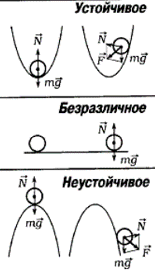
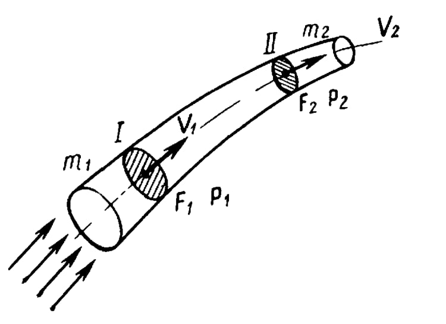

## Статика
**Статика** – это раздел в физике, определяющий условия нахождения тел, сооружений (здания, мосты) и прочего, что изучает и использует человек, в равновесии. Направление также даёт ответы на ряд вопросов, касающихся перемещения тел. Для примера: груз подвешен на не растягивающейся верёвке, перекинутой через блок. Пользуясь открытыми века назад законами статики, определяется сила T, которую необходимо приложить к другому концу шнурка, чтобы система осталась в равновесии. По модулю она будет равной притяжению (*P*). При этом учитываются силы или коэффициент трения, растяжения верёвки.
Статика даёт намного больше, чем условия равновесия. Позволяет узнать, что нужно сделать, чтобы ввести систему в такое состояние или вывести из него. Для перемещения груза вверх следует приложить усилие, превышающее *P*, для опускания – уменьшить ниже силы притяжения. Статика даёт понимание направления движения тел при нарушении равновесия определённым образом.
Изначально статика была разделом механики, отвечающим и на вопросы перемещения тел. Например, когда возникала необходимость использования простых механизмов – рычагов, блоков – для изменения положения массивных предметов, то есть нарушения их равновесия. Различают следующие виды равновесий:
1.	**Устойчивое** – при мизерном отклонении равновесия тело возвращается в начальное положение.
2.	**Безразличное** – при малом отклонении тело не теряет равновесия.
3.	**Неустойчивое** – при отклонении от состояния равновесия возникает воздействие, повышающее отклонение.

</img>

 
Статика имела огромное значение для инженеров и архитекторов древности. Увы, она не позволяет узнать, насколько быстро будет передвигаться груз на нитке, переброшенной через блок. Вопрос производительности подняли с появлением сложных механизмов, развитием тепловых двигателей.

# Формулы статики в физике
Для проведения расчётов, проектирования и решения задач достаточно знать основные формулы статики.
*Сила трения*:
$F\,{трения} = \mu N$ , здесь:
* μ – коэффициент трения – указывает на отношение между трением и силой, прижимающей тело к опоре;
* N – сила реакции нитки, опоры.

*Момент силы*:
$M = Fd$ или $M = Fl$, здесь:
* F – модуль действующей на тело силы;
* d или l – длина плеча.

*Вращающий по часовой стрелке момент силы считается положительным, против – отрицательным.*
*Векторная сумма действующих на тело сил равняется нулю: F=0.*
*Момент инерции*:
$J = mr^2$, здесь:
* m – масса тела;
* r – радиус.

*Давление, оказываемое телом на опору: нитку, поверхность*:
$p = \frac{F}{S}$,
* F – сила;
* S – площадь контакта.

*Правило рычага*:
$\frac{F1}{f2} = \frac{d1}{d2}$, здесь:
* F1, F2 – приложенные к плечам рычага силы;
* d1, d2 – длина плеч.
---

**Задача 1. Момент силы**
На рычаг в состоянии равновесия действуют две силы. Момент первой равен 20 Н*м. Модуль второй силы равен 5 Н. Найдите плечо второй силы.
**Решение**
Запишем условие равновесия рычага: $M_1=M_2$
Отсюда:
$$M_1 = F_2d_2$$
$$d_2=\frac{M_1}{F_2} = \frac{20}{5} = 4м.$$
Ответ: 4м.
**Задача №2. Статика**
На концах рычага действуют силы с модулями 20 и 120 Н соответственно. Рычаг находится в равновесии. Найдите длину рычага, если расстояние от точки опоры до большей силы равно 2 см.
**Решение**
Запишем равенство моментов:
$$M_1 = M_2, F_1d_1=F_2d_2$$
$$d_1=\frac{F_2}{F_1}d_2 = \frac{120}{20}*2 = 12см$$
$$l = d_1 + d_2 = 12+2 = 14см$$
Ответ: 14 см.
В этой задаче мы не переводили размерности в систему СИ.
**Задача №3. Расчет силы**
Рабочий на стройке поднимает плиту с помощью рычага. Большее плечо равно 2,4м, меньшее - 0,8м. Какую силу прикладывает рабочий к большему плечу рычага, если масса плиты равна 120 кг?
Решение
Обозначим большее плечо через d1. К нему рабочий прикладывает искомую силу F1. Вторая сила, приложенная к меньшему плечу, равна весу плиты.
 
$$F_2 = P = mg = 1200H$$
$$F_1d_1 = F_2d_2$$
$$F_1 = \frac{F_2d_2}{d_1}=\frac{1200*0,8}{2,4} = 400H$$
Ответ: 400 Н.

# Гидростатика
## Давление. Закон Паскаля. Гидростатическое давление
Основным отличием жидкостей от твердых (упругих) тел является способность легко изменять свою форму. Части жидкости могут свободно сдвигаться, перемещаясь друг относительно друга. Поэтому жидкость принимает форму сосуда, в который она налита. В жидкость, как и в газообразную среду, можно погружать твердые тела. В отличие от газов жидкости практически несжимаемы. На тело, погруженное в жидкость или газ, действуют силы, распределенные по поверхности тела. Для описания таких распределенных сил в гидростатике вводится новая физическая величина – **давление**.

**Давление** определяется как отношение модуля силы F, действующей перпендикулярно поверхности, к площади S этой поверхности:

$$P = \frac{F}{S}$$

Если же сила направлена под некоторым **углом к перпендикуляру к площадке**, то создаваемое этой силой давление находится по формуле:

$$P = \frac{F\cos{a}}{S}$$

В системе СИ давление измеряется в паскалях (Па): 1 Па = 1 Н/м2. Часто используются внесистемные единицы: нормальное атмосферное давление (атм) и давление одного миллиметра ртутного столба (мм.рт.ст.):

1 атм = 101325 Па = 760 мм.рт.ст.

**Закон Паскаля**: давление, оказываемое на жидкость (или, к слову, газ), передается в любую точку этой жидкости без изменений и во всех направлениях.

Давление жидкости на дно или боковые стенки сосуда зависит от высоты столба жидкости над той точкой в которой измеряется давление. **Гидростатическое давление столба жидкости рассчитывается по формуле:**

$$P = \rho gh$$

Обратите внимание, что оказываемое давление никоим образом не зависит от формы сосуда, а зависит только от рода жидкости (т.е. её плотности) и от высоты столба этой жидкости. Такое же давление на глубине *h* в соответствии с законом Паскаля жидкость оказывает и на боковые стенки сосуда.

Итак, если в задаче по гидростатике идет речь о давлении столба жидкости на боковую грань в некоторой конкретной точке, то такое давление находится по предыдущей формуле, где *h* – расстояние от этой точки до поверхности жидкости. Но иногда в задачах по гидростатике необходимо рассчитать **среднее** давление на всю боковую поверхность сосуда. В таком случае применим формулу:
$$P\text{бок} = \frac{P\text{поверх}+P\text{дно}}{2} = \frac{\rho*0+\rho gh}{2} = \frac{\rho gh}{2}$$

В этом случае, h – это общая высота столба жидкости в сосуде.

Если жидкость находится в цилиндре под поршнем, то действуя на поршень некоторой внешней силой F, можно создавать в жидкости дополнительное давление p0 = F/S, где: S – площадь поршня. Таким образом, полное давление в жидкости на глубине h можно записать в виде:

$$P = p_0 + \rho gh$$

Если поршень убрать, то давление на поверхность жидкости будет равно атмосферному давлению. Если мы погружаемся в воду, то давление на некоторой глубине тоже будет состоять из двух давлений – давления атмосферы и давления столба воды (которое определяется глубиной погружения).

## Сообщающиеся сосуды

**Сообщающимися** называют сосуды, имеющие между собой канал, заполненный жидкостью. Наблюдения показывают, что в сообщающихся сосудах любой формы однородная жидкость всегда устанавливается на одном уровне. задачи на сообщающиеся сосуды очень распространены в гидростатике.

Иначе ведут себя разнородные жидкости даже в одинаковых по форме и размерам сообщающихся сосудах. Дело в том, что в сообщающихся сосудах должно устанавливаться одинаковое давление на одной и той же высоте во всех частях сосуда. Но если жидкости различные, то и высота столбов этих жидкостей должна быть различной, чтобы создать одинаковое давление. Поэтому, разнородные жидкости в сообщающихся сосудах могут и не устанавливаться на одном уровне.

Алгоритм решения задач по гидростатике на сообщающиеся сосуды:

    1.Сделать рисунок.
    2.Выбрать горизонтальный уровень, ниже которого во всех сосудах находится одинаковая жидкость. Если такого уровня нет, то, естественно, за нулевой уровень выбираем дно сосудов.
    3.Записать давления относительно этого уровня во всех сосудах и приравнять.
    4.При необходимости использовать свойство несжимаемости жидкости (объем жидкости, вытекающей из одного сосуда, равен объему жидкости, втекающей в другой сосуд).
    5.Решить математически полученную систему уравнений.

 
## Гидравлический пресс

Если оба вертикально расположенных цилиндра сообщающихся сосудов закрыть поршнями, то с помощью внешних сил, приложенных к поршням, в жидкости можно создать большое давление p, во много раз превышающее гидростатическое давление ρgh в любой точке системы. Тогда можно считать, что во всей системе устанавливается одинаковое давление p (согласно закону Паскаля). Если поршни имеют разные площади S1 и S2, то на них со стороны жидкости действуют разные силы F1 = pS1 и F2 = pS2. Такие же по модулю, но противоположно направленные внешние силы должны быть приложены к поршням для удержания системы в равновесии. Таким образом, для гидравлического пресса имеем формулу:

$$\frac{F_1}{S_1}=\frac{F_2}{S_2}$$

**Это соотношение вытекает из равенства давлений и выполняется только в идеальном гидравлическом прессе**, т.е. таком в котором нет трения. Если S2 >> S1, то и F2 >> F1. Устройства в которых выполняются эти условия называют гидравлическими прессами (машинами, домкратами). Они позволяют получить значительный выигрыш в силе. Если поршень в узком цилиндре переместить вниз под действием внешней силы F1 на расстояние h1, то поршень в широком цилиндре переместится на расстояние h2, которое может быть найдено из соотношения:

$$S_1h_1 = S_2h_2$$

**Данное соотношение вытекает из равенства объемов и выполняется в любом гидравлическом прессе**. Это выражение получается потому, что при перемещении поршня перемещаются одинаковые объемы жидкости, то есть сколько жидкости ушло из одного цилиндра столько же пришло во второй, или V1 = V2. Таким образом, выигрыш в силе обязательно сопровождается таким же проигрышем в расстоянии. При этом произведение силы на расстояние остается неизменным:

$$F_1h_1 = F_2h_2$$

**Последняя формула вытекает из равенства работ и выполняется только для идеальных машин**, в которых не действуют силы трения. Таким образом, в гидравлическом прессе всё происходит в полном соответствии с «золотым правилом механики»: во сколько раз мы выигрываем в силе, во столько же раз мы проигрываем в расстоянии. При этом ни одна машина не может дать выигрыша в работе.

Так как гидравлический пресс является механизмом, то его работу можно характеризовать КПД (коэффициентом полезного действия). **КПД гидравлического пресса** в задачах по гидростатике рассчитывается по следующей формуле:

$$\eta = \frac{F_2h_2}{F_1h_1}$$

где: $A_{пол} = F_2h_2$ – полезная работа (работа по подъему груза), Азатр = F1h1 – затраченная работа. В большинстве задач КПД гидравлического пресса принимают за 100%. КПД рассчитывается в том случае, если речь идет о неидеальном гидравлическом прессе.

Еще раз подчеркнем, что для неидеального гидравлического пресса выполняется только соотношение, вытекающее из равенства объемов вытесненной жидкости, а также для таких прессов рассчитывается КПД. Остальные соотношения из этого раздела выполняются только для идеального гидравлического пресса.

 
## Закон Архимеда. Вес тела в жидкости

Из–за разности давлений в жидкости на разных уровнях возникает выталкивающая или Архимедова сила, которая вычисляется по формуле:

$$F_\text{A} = \rho gV$$

где: V – объем вытесненной телом жидкости, или же объем погружённой в жидкость части тела, ρ – плотность жидкости в которую погружено тело, и следовательно, ρV – масса вытесненной жидкости.

**Архимедова сила, действующая на погруженное в жидкость (или газ) тело, равна весу жидкости (или газа), вытесненной телом.** Это утверждение, называемое **законом Архимеда**, справедливо для тел любой формы.
При этом вес тела (т.е. сила с которой тело действует на опору или подвес) погруженного в жидкость уменьшается. Если принять, что вес покоящегося тела в воздухе равен mg, а именно так мы и будем поступать в большинстве задач (хотя вообще говоря на тело в воздухе также действует очень маленькая сила Архимеда со стороны атмосферы, ведь тело погружено в газ из атмосферы), то для веса тела в жидкости можно легко вывести следующую важную формулу:

$$P\text{тела в жидкости} = P\text{тела в воздухе}(1-\frac{\rho\text{жидкости}}{\rho\text{тела}})$$

Эта формула может быть использована при решении большого количества задач. Ее можно запомнить. При помощи закона Архимеда осуществляется не только мореплавание, но и воздухоплавание. Из закона Архимеда вытекает, что если средняя плотность тела ρт больше плотности жидкости (или газа) ρ (или по–другому mg > FA), тело будет опускаться на дно. Если же ρт < ρ (или по–другому mg < FA), тело будет плавать на поверхности жидкости. Объем погруженной части тела будет таков, что вес вытесненной жидкости равен весу тела. Для подъема воздушного шара в воздухе его вес должен быть меньше веса вытесненного воздуха. Поэтому воздушные шары заполняют легкими газами (водородом, гелием) или нагретым воздухом.

 
## Плавание тел

Если тело находится на поверхности жидкости (плавает), то на него действует всего две силы (Архимеда вверх и тяжести вниз), которые уравновешивают друг друга. Если тело погружено только в одну жидкость, то записав второй закон Ньютона для такого случая и выполнив простые математические операции можем получить следующее выражение связывающее объемы и плотности:

$$\frac{V\text{погр}}{V} = \frac{\rho\text{тела}}{\rho\text{жидкости}}$$

где: Vпогр – объем погруженной части тела, V – полный объем тела. При помощи этого соотношения легко решается большинство задач на плавание тел.

## Гидродинамика.
 – раздел гидравлики, в котором изучаются законы движения жидкости и ее взаимодействие с неподвижными и подвижными поверхностями.

# Основные понятия:
   Основным объектом изучения гидродинамики является поток жидкости, под которым понимают движение массы жидкости, ограниченной полностью или частично какой-либо поверхностью (поверхностями). Ограничивающая поверхность может быть твердой (стенки труб, берега и дно рек, каналов и т. д.), жидкой (граница двух жидкостей с разными физическими свойствами) и газообразной (например, граница между поверхность ю жидкости и атмосферой и т. п.). 
   Движение жидкости может быть установившимся (стационарным) и неустановившимся (нестационарным). Установившимся называют движение, при котором давление и скорость жидкости в любой точке занятого ею пространства с течением времени не изменяются. При неустановившемся движении в каждой точке пространства, занятом жидкостью, скорость и давление изменяются с течением времени.
   Движение жидкости может быть равномерным и неравномерным. Равномерным называют движение, при котором скорости в сходственных точках двух смежных сечений потока жидкости равны между собой. В противном случае движение неравномерное. Если обратиться к предыдущему опыту с сосудом и конической трубкой, то можно заметить, что истечение жидкости через коническую трубку в обоих случаях (с постоянным и пере менным уровнем в сосуде) равномерным не будет. Коническая трубка имеет непостоянное сечение, и скорость жидкости при движении по ней будет непрерывно изменяться. Если заменить в этом опыте коническую трубку цилиндрической, то движение жидкости в ней будет равномерным.
   Различают напорное и безнапорное движение жидкости. Если стенки полностью ограничивают поток жидкости, то движение жидкости называют напорным (например, перемещение жидкости по полностью заполненным трубам). Если же ограничение потока стенками частичное (например, движение воды в реках, каналах), то такое движение называют безнапорным. Напорные потоки иногда называют сплошь заполненными, а безнапор ные – открытыми руслами.
  Для того чтобы движение жидкости можно было считать полностью определенным, необходимо знать распределение величины и направления скорости частиц в потоке, а также зависимость этого распределения от времени. Направление скоростей в потоке характеризуется линией тока. Линия тока – воображаемая кривая, проведенная внутри потока жидкости таким образом, что скорости всех частиц, находящихся на ней в да нный момент времени, касательны к этой кривой.
Основные уравнения гидродинамики 
Главными гидродинамическими уравнениями являются уравнение неразрывности или сплочённости сред, а также уравнение Бернулли. Уравнение неразрывности представляет собой формулу стабильности расхода и записывается следующим образом: 
$dQ1 + dQ2 = dQ = const$, где:
Q1, Q2, Q – скорости начального движения частиц жидкости в различных живых сечениях струйки. 
Для потока уравнение сплоченности сред будет выглядеть так:
$Q1 = Q2 = Q$
***Замечание 1***
 Уравнение Бернулли считается фундаментальным законом гидродинамики. Оно устанавливает взаимосвязь между скоростью, давлением, и положение исследуемого элемента в пространстве. Посредством этого уравнения решается огромный круг сложных инженерных задач. 

# Закон Паскаля 
В случае, когда все массовые силы отсутствуют, т.е. g = 0, из этих формул получается, что p = 0. откуда следует, что p = const. Это решение носит в науке название закона Паскаля, который предполагает, что в покоящейся жидкости (газе) при отсутствии массовых и постоянных сил давление постоянно. 
Уравнение состояния идеального газа p = ρRT , отсюда можно найти плотность газа в зависимости от начальной температуры 
$P = \frac{p}{RT}$. 
Это обыкновенное дифференциальное уравнение первого порядка для внутреннего давления p = z . Оно решается согласно принципу разделения переменных: 
$\frac{dp}{p} = \frac{dz}{RT}g$.
 Закон Паскаля в гидродинамике даёт формулу изменения давления с высотой, если известно точное распределение температуры по заданной величине. В частном случае, это действует в случае, если считать атмосферу изотермической, когда $Т = const$. 
Эта формула доказывает, что давление в изотермической атмосфере постепенно убывает с высотой по экспоненциальному закону.

## Аэродинамика
# Основные понятия и законы аэродинамики Аэродинамика, её содержание и место в ряду специальных дисциплин 

**Аэродинамикой** называют науку, изучающую законы движения воздуха (газа) и механическое взаимодействием между воздухом (газом) и движущимся в нем телом. Раздел аэродинамики, рассматривающий воздух как несжимаемую жидкость, носит название *гидроаэродинамики*.
При движении с большими гиперзвуковыми скоростями возникают явления ионизации молекул воздуха, изменяющие его физические свойства. Аэродинамика ионизированного газа называется *магнитоаэродинамикой*.
Аэродинамика является теоретической основой авиации. На ней базируются науки:
- теория крыла,
- теория воздушного винта,
- динамика полета,
- аэродинамический расчет,
- устойчивость и управляемость самолета.

Возможность летания на аппаратах тяжелее воздуха проверялась в исследованиях И. Ньютона (1642 – 1727) гг.

Ньютон установил зависимость величины аэродинамической силы от плотности среды, площади несущей поверхности и квадрата скорости перемещения. Почва для зарождения аэродинамики как науки была подготовлена трудами М.В. Ломоносова (1711 – 1765 гг.) и его современников Л. Эйлера (1707 – 1783 гг.), Д. Бернулли (1700 – 1782 гг.)

Д. Бернулли вывел одно из важнейших уравнений аэродинамики, дающее простое физическое объяснение образования подъемной силы.

В конце XIX века в период с 1882 по 1884 гг. русским изобретателем А.Ф. Можайским был построен первый самолет. Самолет Можайского имел крыло площадью примерно 370м2, фюзеляж в виде лодки, горизонтальное и вертикальное оперение, четырехколесное шасси, три воздушных винта. Винты приводились во вращение двумя паровыми машинами общей мощностью примерно 30 л.с. Общий вес аппарата был около 900 кг.

# Основные законы аэродинамики:
**Уравнение неразрывности.**
Уравнение неразрывности струи воздушного потока (постоянства расхода ) — это уравнение аэродинамики, вытекающее из основных законов физики - сохранения массы и инерции. Устанавливает связь между плотностью, скоростью и площадью поперечного сечения струи воздушного потока.

</img>

 
Уравнение сформулировано Л. Эйлером в 1756г. применительно к движению струйки жидкости.
В струйке переменного сечения через сечение I за одну секунду протекает некоторый объем воздуха (Рисунок). Этот объем равен произведению скорости воздушного потока V на площадь поперечного сечения F.
Секундный массовый расход воздуха в струйке mc равен произведению секундного объема на плотность ρ воздушного потока.
Согласно закону сохранения материи масса жидкости (воздуха) в струйке m1, протекающей через сечение I, должна быть равна массе m1, протекающей через сечение II при условии, если движение воздушного потока установившееся:
$m_1=m_2=const$,  $ρ_1 F_1V_1= ρ_2 F_2V_2=const$.
Для любого сечения струйки можно записать:
$ρFV=const$.
Это выражение называется ***уравнением неразрывности*** *(постоянства расхода)* для струйки воздушного потока.
Для несжимаемой жидкости уравнение можно записать в следующем виде: $F_1V_1=F_2V_2= const$ или в виде пропорции:

$$\frac{F_1}{F_2}=\frac{V_2}{V_1}=const$$
 
Из формулы видно, что для любого сечения скорость воздушного потока струи обратно пропорциональна площади ее поперечного сечения и наоборот:

$$V=\frac{const}{S}$$ 

---
Задача. Определить скорость течения потока жидкости V2 в узком сечении трубки площадью $S_2=5см^2$,если через широкое сечение трубки площадью $S_1=7,5см^2$ скорость течения составляет $V1=20м/с$.
Решение: $V_2/V_1=S_1/S_2.$ $V_2=V_1S_1/S_2=20*7,5/5=30м/с.$

#Закон Бернулли.
Основные явления, происходящие при течении газа и жидкости, можно объяснить, применяя к движущейся среде закон сохранения энергии.
Выделим струйку в потоке несжимаемого газа и проведем в ней два поперечных сечения 1 и 2 (см. Рисунок). Этими поперечными сечениями определится объем газа, к которому мы применим закон сохранения энергии. При этом будем считать, что движение газа установившееся.
Пусть за единицу времени через сечение 1 проходит масса газа m1. В этом месте струйки газ имеет скорость V1, а давление p1. За то же время через другое сечение 2 струйки , где скорость газа равна V2, а давление p2, вытекает такая же масса газа m2.
При установившемся течении в выделенной части струйки не происходит ни накапливания, ни расхода энергии, т.к. между струйкой и окружающей её средой обмен энергией отсутствует.
Следовательно, энергия, передаваемая газу за единицу времени через сечение 1, должна быть равна энергии, передаваемой за то же время через сечение 2.

Согласно закону сохранения энергии, полная энергия струйки воздушного потока в различных сечениях есть сумма нескольких видов энергии потока: кинетической, потенциальной энергии сил статического давления, внутренней энергии и энергии положения. Эта сумма должна быть величиной постоянной:
$Екин+Ер+Евн+Еп=соnst.$
Кинетическая энергия $Екин$ - способность движущегося воздушного потока совершать работу под действием сил динамического давления;
Потенциальная энергия $Ер$ - способность воздушного потока совершать работу под действием сил статического давления;
Внутренняя энергия $Евн$ - это способность газа совершать работу при изменении его температуры;
Энергия положения $Eп$ - способность воздуха совершать работу при изменении положения центра тяжести данной массы воздуха при подъеме на определенную высоту.

Преобразуем уравнение сохранения полной энергии: для сечений 1,2,3:

$$P_1 + \frac{\rho_1V_1^2}{2} = P_2 + \frac{\rho_2V_2^2}{2} = P_3 + \frac{\rho_3V_3^2}{2}$$
где: P- статическое давление; $\frac{\rho V^2}{2}$ - скоростной напор.
Для любого сечения струйки воздуха уравнение можно записать в следующем виде:
 
В таком виде записывается уравнение Бернулли.

---
Задача.Необходимо узнать, чему равна подъёмная сила крыла Ан–4 дозвукового самолёта, если площадь крыла равна 72м2, а скорость потока воздуха над крылом и под ним равны соответственно 320м/с и 290м/с.
Дано : Решение:
S = 72м2 Уравнение Бернулли:
Vнад = 320м/с
Vпод = 290м/с
возд = 1, 29кг/м3
Fпод - ?
Подъёмная сила самолета Ан-4 приблизительно равна 850Н. Но надо заметить, что исследователи отмечают, что **этот закон действует, если скорость движения воздушного потока не превышает скорость звука (до 340 м/с)**. При скоростях выше скорости звука воздушный поток ведёт себя по-другому.
В будущем хотелось бы это утверждение проверить самому.
**Зависимость подъёмной силы самолета от площади его крыла и скорости**
В дальнейшем процессе выполнения работы я решил познакомиться с характеристиками различных самолетов. Выбрал максимальную скорость и площадь крыла и занёс их в таблицу.
Что же заинтересовало меня в этих параметрах?
Чем меньше скорость, тем больше площадь крыла.
|    | Су- 47 | МИГ -29 | Ан-4 | Бе-200чс | Ил-76 | Boeing 767-300 |
|----|:------:|:-------:|:----:|:--------:|:-----:|-------------:|
|S крыла | 56м2 | 38м2 | 71,68м2 |	117,44м2 |	300м2 |	383.3м2 |
|V Макс.скорость | 2500км/ч | 2450км/ч | 230км/ч | 610км/ч | 850км/ч | 910км/ч

Например, максимальная скорость ИЛ-76 - 850км/ч, площадь крыла – 300м2, у МИГ-29 скорость 2450 км/ч, площадь крыла 38 м2.
**Получается, самолеты, рассчитанные на полет с различной скоростью, имеют различные размеры крыльев.**
